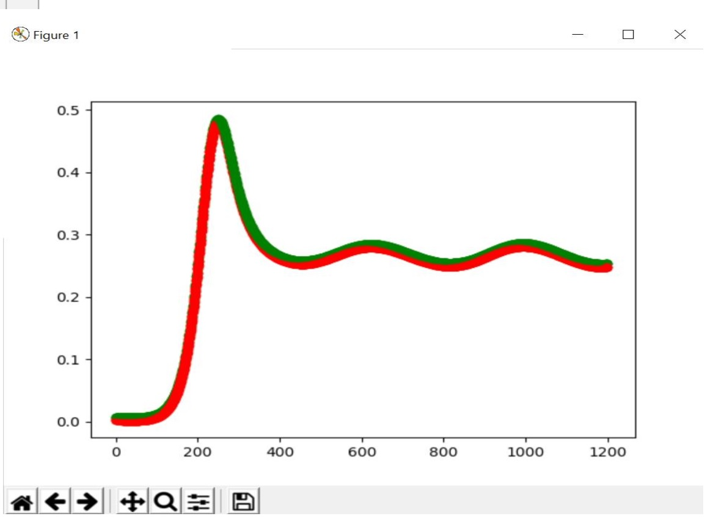
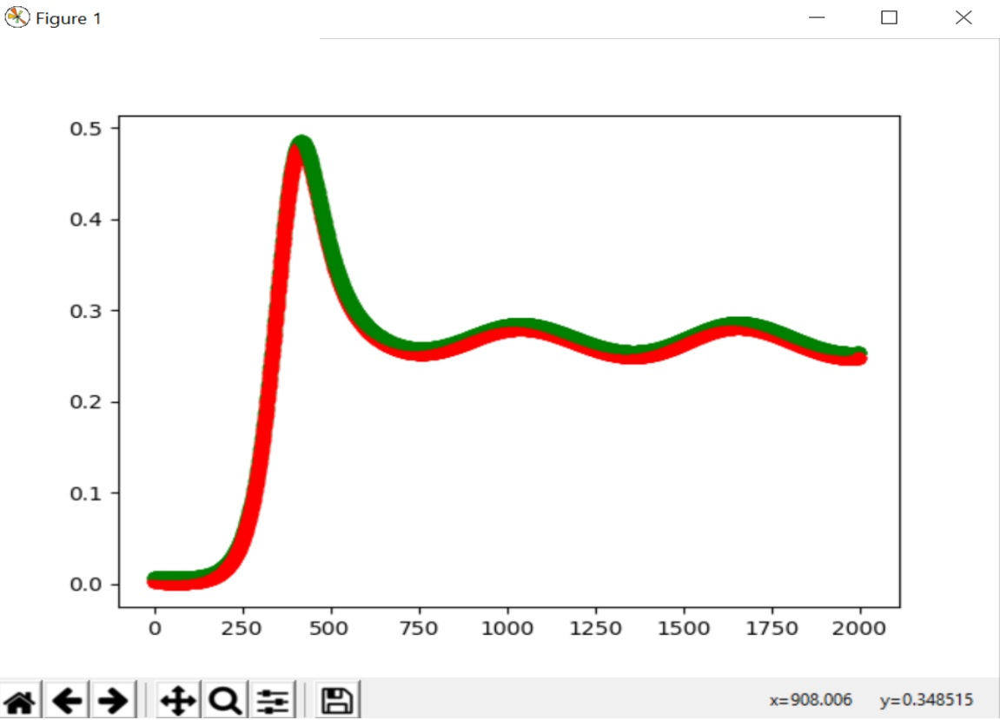
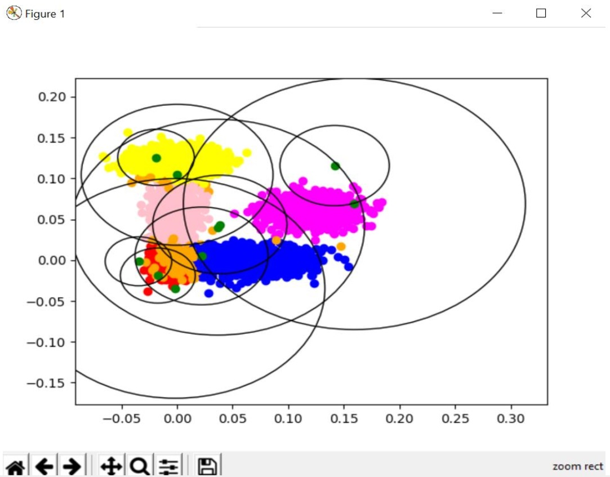
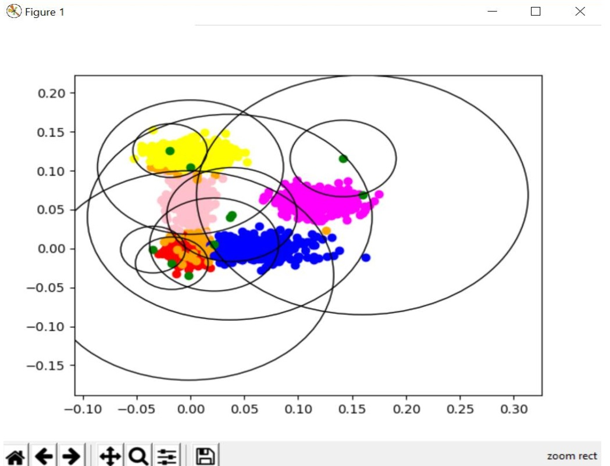

## Training-RBF-neural-network
using ES algorithm to train RBF network and implement regression and classification on dataset

in this project python DEAP library has been used in order to get access to Evolution Strategy algorithm
and the fitness of evolutionary algorithm has been calculated using the RBF network.

the activation function of the network(G), guessed output(guessedY), weights' matrix(W) and finally the loss which is
our fitness have been calculated and modified during the algorithm. ( relations available in the definition.pdf file )

### for regression we have:
* X(our data) = n * d 
* Y = n * 1
* W = m * 1 (m = numOfClusters)
* G = n * m

#### the output of regdata2000 dataset:
iterations = 10

clusters = 10

* training mode:
error = 0.015

* testing mode:
error = 0.026

#### the output of 5clstest5000 dataset:
#### note that the wrong classified data is orange and the centers of clusters are green
iterations = 8

clusters = 10

* training mode:
accuracy = 96.5 %

* testing mode:
accuracy = 96.2 %

